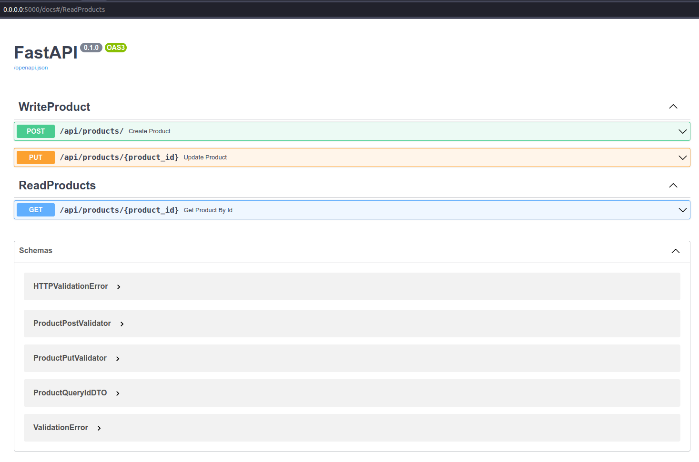
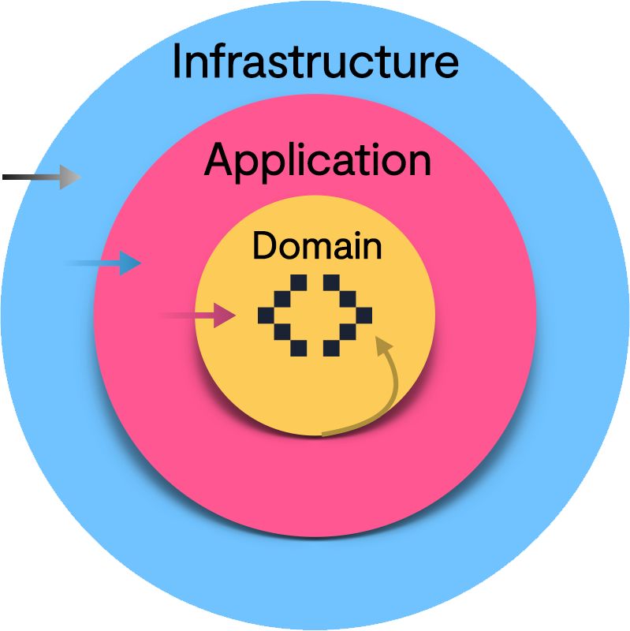
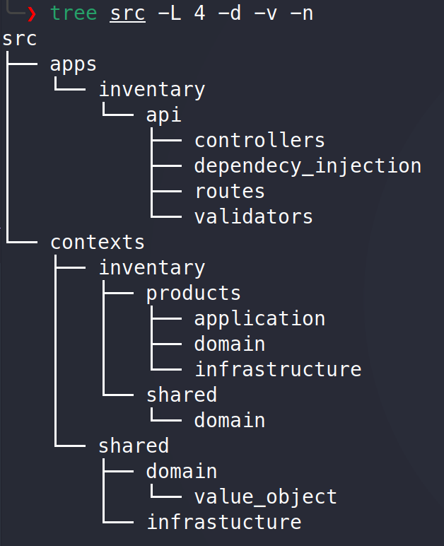
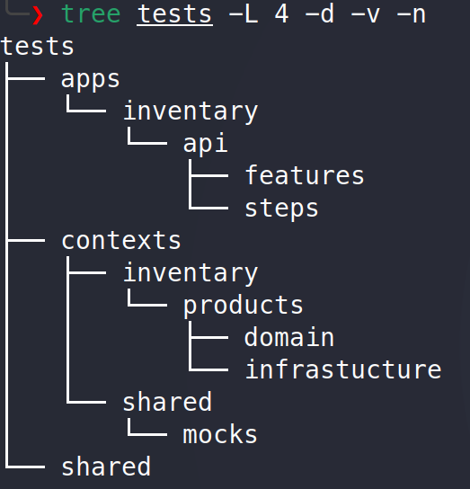
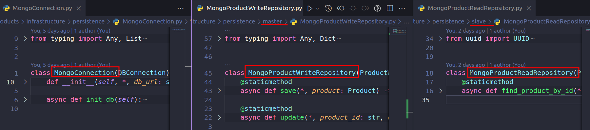
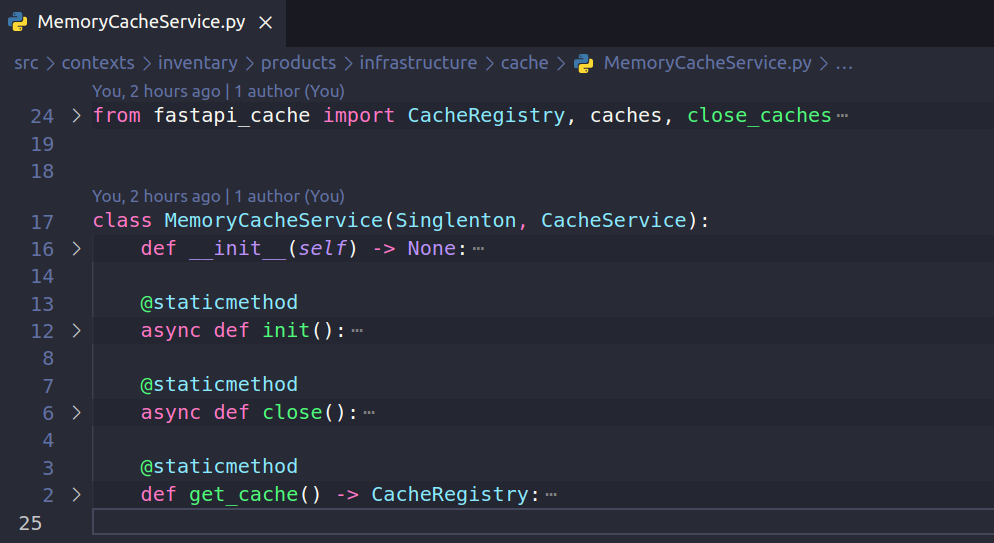
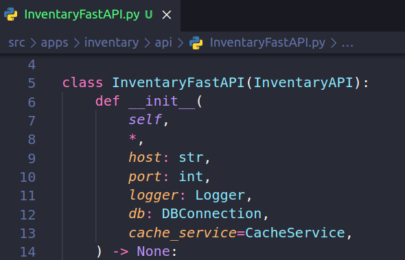
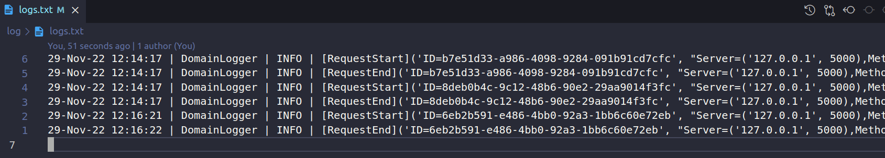
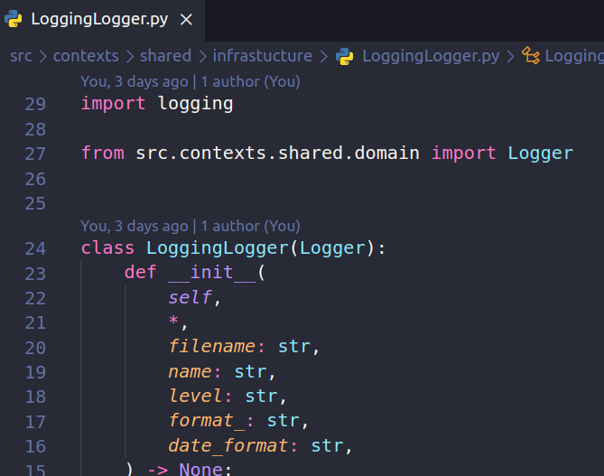
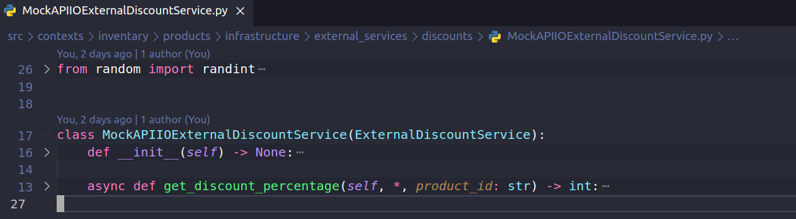

# **TekTonLabsTest**
## **Installation**
0. *Requirements =>*
    [Docker](https://docs.docker.com/engine/install/) and
    [DockerCompose](https://docs.docker.com/compose/install/)

1. *Build app(Only one time)*
   ```sh
    >>[DirProject] make build
   ```
2. *Start app*
   ```sh
    >>[DirProject] make start
   ```
3. *Stop app*
   ```sh
    >>[DirProject] make stop
   ```
## **Usage**
*Check API Documentation =>* http://0.0.0.0:5000/docs



## **Unit Tests and Coverage**
```sh
>>[DirProject] make coverage 
```

```sh
>>[DirProject] make all_test 
```

```sh
>>[DirProject] make unit_test 
```

```sh
>>[DirProject] make feature_test 
```

## **Implementation**
### **1. Architecture**
The architecture used to do scalable and maintainable the project was *Hexagonal architecture* and oriented to *Bounded contexts* desing; in this case the Bounded Context *Inventary* with the module *products*.



#### **Folder structure *SRC***


#### **Folder structure *Tests***


### **2. Persitence**
Using the library [beanie](https://github.com/roman-right/beanie) with the  asyncronous implementation using the driver [motor](https://motor.readthedocs.io/en/stable/) with CQRS master/slave strategy

*Implementation*


### **3. Cache**
Using the library [fastapi_cache](https://github.com/comeuplater/fastapi_cache) with *MemoryCache*

*Implementation*



### **4. Web server**
Using the asynchronous framework [fastapi](https://fastapi.tiangolo.com/) with ASGI web server [uvicorn](https://www.uvicorn.org/) 

*Implementation*



### **5. Logger**
Check the file in *[DirProject]/log/logs.txt*



*Implementation*



### **6. External Discount Service**
Check the mock api => https://638391421ada9475c80319c0.mockapi.io/api/discounts

*Implementation*



## **Stack**
The technologies used for this project were the following:
* [Python3](https://www.python.org/) 
* [FastAPI](https://fastapi.tiangolo.com/)
* [Mongo](https://www.mongodb.com/)
* [Docker](https://www.docker.com/)
